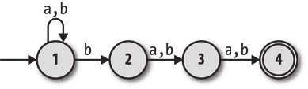

# ruby-regular-expression
计算的本质 3.3 正则表达式 具体实现

测试中的NFA为



## 在Ruby中表示自由移动（free move）

将输入字符表示为Ruby中的`nil`

```ruby
# 输入为空，代表free move
FARule.new(1, nil, 2)

# 输入为a
FARule.new(2, 'a', 3)
```

有限自动机读取的字符通常叫做*符号（symbol）*，状态之间移动的规则叫做*转移（transition）*，组成一台机器的规则集合叫作*转移函数*（有时也叫NFA的转移关系）而不是规则手册。